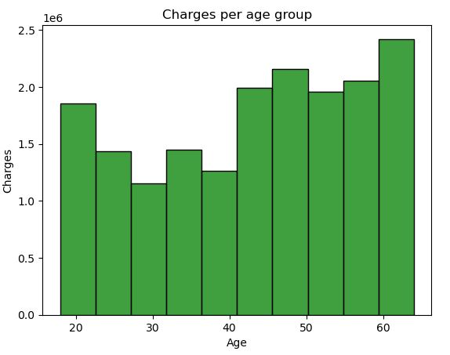

# [NBA Projects](https://github.com/calvint13/NBA_Project)

## NBA Webscraping

Utilized the NBA Stats API to access player statistics for different seasons, including points per game, rebounds, assists, steals, blocks, turnovers, and shooting percentages.

### Python Libraries Used:
Pandas, numpy, time, requests

 

## Analysis and Prediction of LeBron James' Regular Season Performance

### Python Libraries Used:

Pandas, numpy, matplotlib, seaborn, sktime, fbprophet

### Findings:

LeBron James' regular season stats show fewer games (75 to low 70s) and minutes (high 30s to mid 30s), with assists up (under 7 to over 7) and scoring down (27+ to low 20s). His field goals (high 50s) and free throws (over 73%) remain efficient, while rebounds (over 8 to low 7s), steals, and blocks (over 1.5 to under 1) declined with age.

The model's predictions for LeBron's 2018 stats were remarkably close in key areas:

Points: Predicted (26.5) vs. Actual (27.4) - Difference of only 0.9 points.

Assists: Predicted (8.5) vs. Actual (8.3) - Difference of just 0.2 assists.

Rebounds: Predicted (7.5) vs. Actual (8.5) - Model slightly underestimated rebounding by 1 rebound.

Games played and minutes per game showed a slight discrepancy:

Games Played: Predicted (75) vs. Actual (82) - Model underestimated games played by 7 games.

Minutes Played: Predicted (36.5) vs. Actual (36.9) - A minor difference of 0.4 minutes.

 

# [Insurance Analysis](https://github.com/calvint13/Insurance_Project)

### Python Libraries Used:

Pandas, Numpy, matplotlib, seaborn, scipy.stats, sklearn

### Findings:

Our analysis reveals that individuals aged 40 to 60 generate the highest insurance charges. Key factors influencing insurance costs include Age, BMI, number of children, and smoking habits. When these factors converge in the 40-60 age range, they significantly impact pricing. This understanding helps providers refine their pricing models for more accurate and equitable risk assessment.

  

  

# [School Projects](https://github.com/calvint13/School_Projects)

These school projects showcase my skills in data analysis, machine learning, and neural networks. I classified vegetable images using custom and transfer learning models, predicted tech workers' compensation with regression techniques, and detected fraud in transaction data with neural networks. I handled imbalanced datasets, performed feature engineering, and optimized models through hyperparameter tuning, while maintaining clear and organized code.

  

# Power BI Projects

## Interactive Resume

Created a dynamic, visually engaging resume from scratch with Power BI, integrating data from various sources to showcase professional experience and achievements. Designed intuitive dashboards with custom visuals and interactive elements to enhance user engagement and effectively communicate expertise.

## Covid Dashboard

Built a detailed COVID-19 dashboard by integrating data from multiple Excel sheets using Power Query, allowing for seamless real-time analysis and visualization. Designed interactive features and visuals to effectively track and present key metrics, trends, and insights

