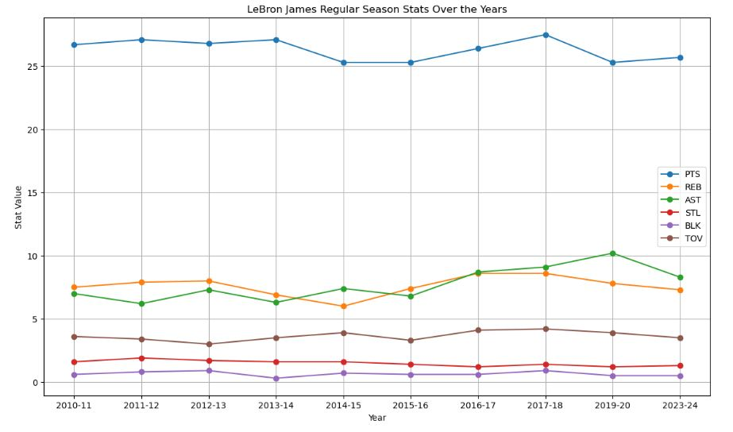
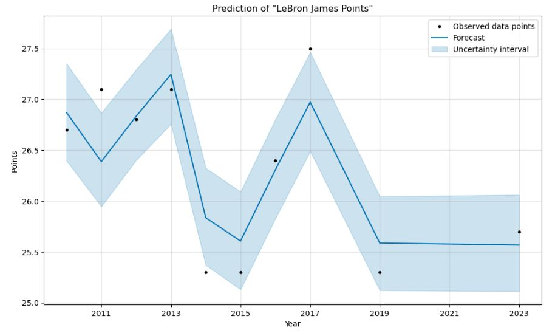
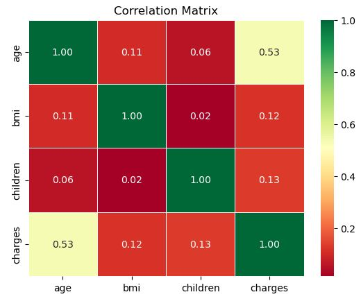
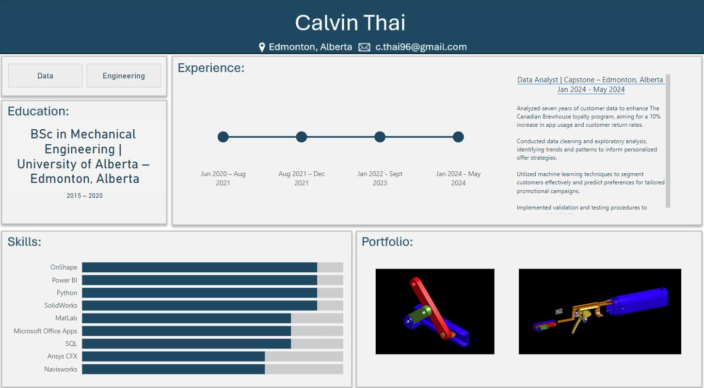

# [NBA Projects](https://github.com/calvint13/NBA_Project)

## NBA Webscraping

Utilized the NBA Stats API to access player statistics for different seasons, including points per game, rebounds, assists, steals, blocks, turnovers, and shooting percentages.

 

## Analysis and Prediction of LeBron James' Regular Season Performance

Conducted an in-depth analysis of LeBron James' regular season statistics from 2010 to 2023, including games played, minutes, points, assists, rebounds, steals, blocks, turnovers, field goal percentage, three-point percentage, and free throw percentage. Implemented machine learning techniques to handle missing data for the years 2018-2019 and 2020-2023. Utilized the Facebook Prophet model to predict missing values in points and other statistics, visualizing trends and predictions using Matplotlib for clear presentation.

 

# [Insurance Analysis](https://github.com/calvint13/Insurance_Project)

This analysis of the Medical Cost Personal Datasets showcases my skills in data exploration and analysis. Through thorough examination and statistical testing, I uncovered insights into insurance pricing dynamics, identifying influential factors such as age, BMI, and smoking habits. Leveraging libraries like Pandas, NumPy, and Scipy, alongside Linear Regression models, I ensured accurate interpretation and visualization of the data, fostering fairness and equity in insurance pricing strategies.

  

  

# [School Projects](https://github.com/calvint13/School_Projects)

These school projects showcase my skills in data analysis, machine learning, and neural networks. I classified vegetable images using custom and transfer learning models, predicted tech workers' compensation with regression techniques, and detected fraud in transaction data with neural networks. I handled imbalanced datasets, performed feature engineering, and optimized models through hyperparameter tuning, while maintaining clear and organized code.

# Power BI Projects

## Interactive Resumne

Created a dynamic, visually engaging resume from scratch with Power BI, integrating data from various sources to showcase professional experience and achievements. Designed intuitive dashboards with custom visuals and interactive elements to enhance user engagement and effectively communicate expertise.

## Covid Dashboard

Built a detailed COVID-19 dashboard by integrating data from multiple Excel sheets using Power Query, allowing for seamless real-time analysis and visualization. Designed interactive features and visuals to effectively track and present key metrics, trends, and insights

